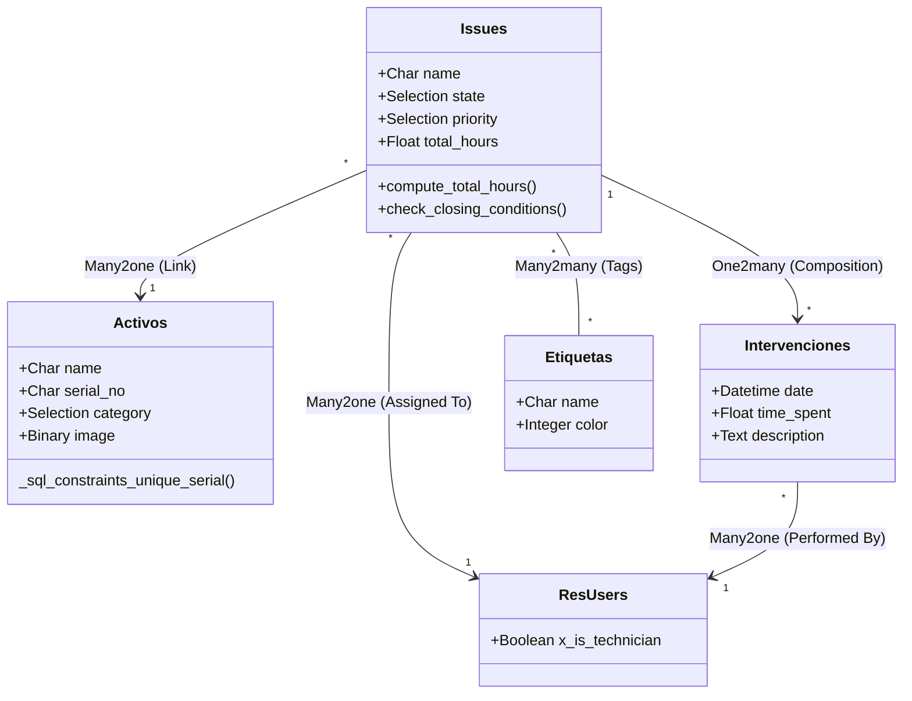
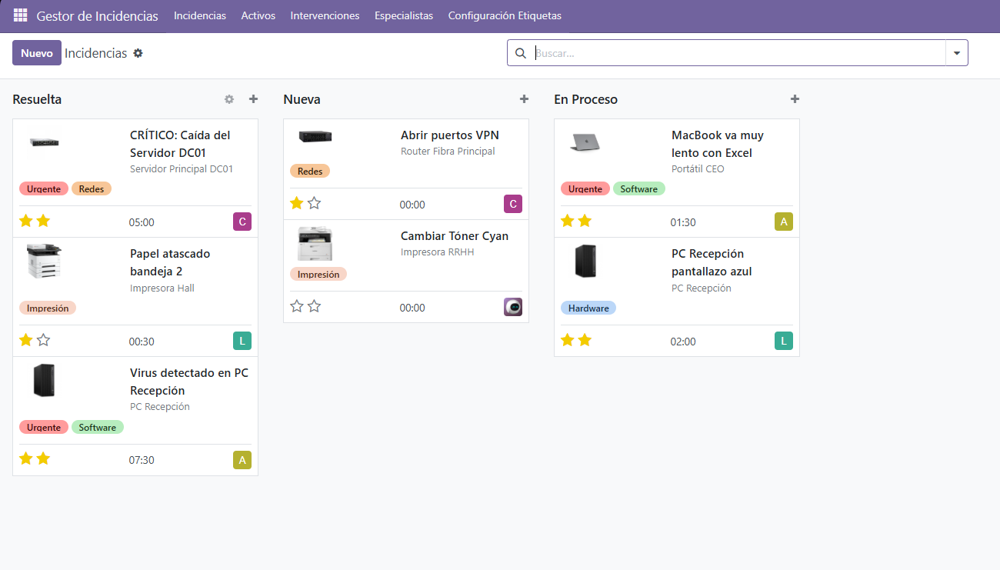
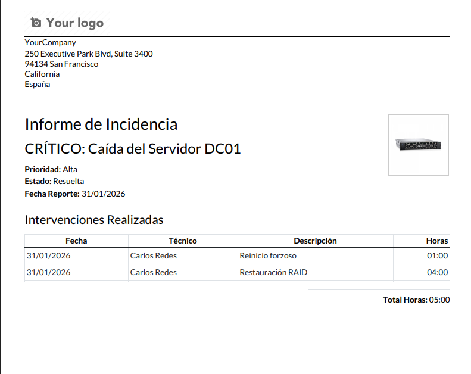

# 🛠️ SCF Incidencias - Gestión de Soporte IT para Odoo 17


## 📖 Descripción del Proyecto

**SCF Incidencias** es un módulo vertical desarrollado para Odoo 17 que digitaliza y automatiza el departamento de **Soporte Técnico (Helpdesk)**. 

Este proyecto profesionaliza la gestión de tickets integrando inventario de activos (CMDB), control de tiempos, gestión de especialistas externos y reporting avanzado. El sistema incluye lógica de negocio personalizada para garantizar la calidad del dato y la eficiencia operativa.

---

## ✨ Características Funcionales

### 🎫 Gestión Inteligente de Tickets
- **Workflow de Estados:** Ciclo de vida definido (`Nueva` > `En Proceso` > `Resuelta`) gestionado mediante barra de estado interactiva.
- **Priorización Automática:** El sistema eleva la prioridad automáticamente a "Alta" si el activo afectado es crítico (ej: Servidores o Redes).
- **Validación de Calidad:** Restricción de código (`Python Constraint`) que impide cerrar una incidencia si el técnico no ha imputado las horas trabajadas.
- **Vistas Avanzadas:** Kanban visual, Calendario de planificación y Panel de Actividades.

### 🖥️ Inventario y Trazabilidad (CMDB)
- **Activos IT:** Inventario detallado con fotos reales de los equipos.
- **Integridad de Datos:** Validación SQL (`_sql_constraints`) que impide la duplicidad de Números de Serie.
- **Historial:** Vinculación directa Incidencia-Activo para trazar averías recurrentes.

### ⏱️ Control de Tiempos
- **Partes de Trabajo:** Registro granular de intervenciones por técnico y fecha.
- **Cálculo Automático:** El campo `total_hours` se calcula dinámicamente sumando las intervenciones, eliminando errores manuales.

### 👨‍💻 Gestión de Especialistas
- **RRHH Externo:** Gestión de perfiles técnicos externos y certificaciones (`Junior`, `Senior`, `Master`).
- **Integración Social:** Uso de `mail.thread` para gestión documental (CVs, contratos) en la ficha del especialista.

### 📊 Informes y Business Intelligence
- **Reportes PDF:** Generación de partes de trabajo con motor **QWeb**, incluyendo desglose de horas y firma.
- **Dashboard:** Vistas de Gráfico y Tabla Dinámica (Pivot) para análisis de carga de trabajo.

---

## 🏗️ Arquitectura Técnica (Memoria de Desarrollo)

El módulo sigue estrictamente el patrón MVC (Modelo-Vista-Controlador) de Odoo.

### 🧩 Diagrama de Clases (Modelo de Datos)



### 📂 Estructura del Proyecto
```text
scf_incidencias/
├── __init__.py
├── __manifest__.py                   # Descriptor y dependencias (base, mail)
├── demo/
│   └── scf_incidencias_demo.xml      # Escenarios de prueba y usuarios demo
├── i18n/
│   ├── en_US.po                      # Traducción completa al Inglés
│   └── scf_incidencias.pot           # Plantilla de traducción
├── models/                           # Lógica de Negocio (Backend)
│   ├── __init__.py
│   ├── res_users.py                  # Herencia (Inheritance)
│   ├── scf_incidencias_activos.py    # CMDB + SQL Constraints
│   ├── scf_incidencias_especialista.py
│   ├── scf_incidencias_etiquetas.py
│   ├── scf_incidencias_intervenciones.py
│   └── scf_incidencias_issues.py     # Core Logic + Computed Fields
├── reports/                          # Motor de Reporting (QWeb)
│   ├── scf_incidencias_report.xml
│   └── scf_incidendcias_report_tempate.xml
├── security/                         # Control de Acceso (RBAC)
│   ├── ir.model.access.csv           # Matriz de permisos (ACLs)
│   └── scf_incidencias_security.xml  # Definición de Grupos
├── static/                           # Recursos Estáticos
│   ├── description/
│   │   └── icon.png                  # Icono del módulo
│   └── img/                          # Imágenes de activos demo
│       ├── brother.jpg
│       ├── servidor.jpg
│       └── ...
└── views/                            # Interfaz de Usuario (XML)
    ├── menus.xml
    ├── res_users.xml
    ├── scf_incidencias_activos.xml
    ├── scf_incidencias_especialista.xml
    ├── scf_incidencias_etiquetas.xml
    ├── scf_incidencias_intervenciones.xml
    └── scf_incidencias_issues.xml
```

### 🔐 Seguridad y Roles (ACLs)
Se ha implementado un modelo de seguridad robusto para proteger la integridad de los datos:

| Rol | Grupo XML | Permisos | Descripción |
| :--- | :--- | :--- | :--- |
| **Técnico** | `group_incidencias_user` | Leer, Crear, Editar | Gestión diaria. **Bloqueo de borrado** (`unlink=0`) para evitar pérdida de historial. |
| **Responsable** | `group_incidencias_manager` | Control Total (CRUD) | Administración, borrado de registros y configuración de maestros. |

---

## 🚀 Guía de Instalación y Despliegue

El entorno se basa en Docker Compose para garantizar la reproducibilidad entre desarrollo y producción.

### Requisitos
* Docker Engine & Docker Compose
* Git

### Pasos de Despliegue
1.  **Clonar repositorio:**
    ```bash
    git clone <URL_DEL_REPOSITORIO>
    cd SGE-odoo-devA-14
    ```
2.  **Iniciar contenedores:**
    ```bash
    docker compose up -d
    ```
3.  **Acceso Web:** Entrar en `http://localhost:8069`.
    * *Nota:* Al crear la BD, marcar **"Demo Data"** para cargar los datos de prueba.
4.  **Instalación:** Activar "Modo Desarrollador", actualizar lista de Apps e instalar `scf_incidencias`.

---

## 🧪 Testing y Escenarios

El módulo viene pre-cargado (`demo.xml`) con imágenes reales y usuarios configurados para probar los roles de seguridad:

| Usuario | Contraseña | Rol | Prueba Recomendada |n

| :--- | :--- | :--- | :--- |
| `ana_t` | `ana_t` | **Técnico** | Intentar borrar una incidencia (El sistema debe bloquearlo). |
| `marta_j` | `marta_j` | **Responsable** | Generar un informe PDF y eliminar tickets antiguos. |

---

## 📸 Galería de Vistas

### Tablero Kanban

> Gestión visual del flujo de trabajo con indicadores de color por estado.

### Informe PDF (QWeb)

> Parte de trabajo generado dinámicamente listo para imprimir.

---

## 👤 Autor

**Samuel Copa Flor**
* **Curso:** Desarrollo de Aplicaciones Multiplataforma (DAM)
* **Asignatura:** Sistemas de Gestión Empresarial (SGE)
* **Año:** 2025/2026